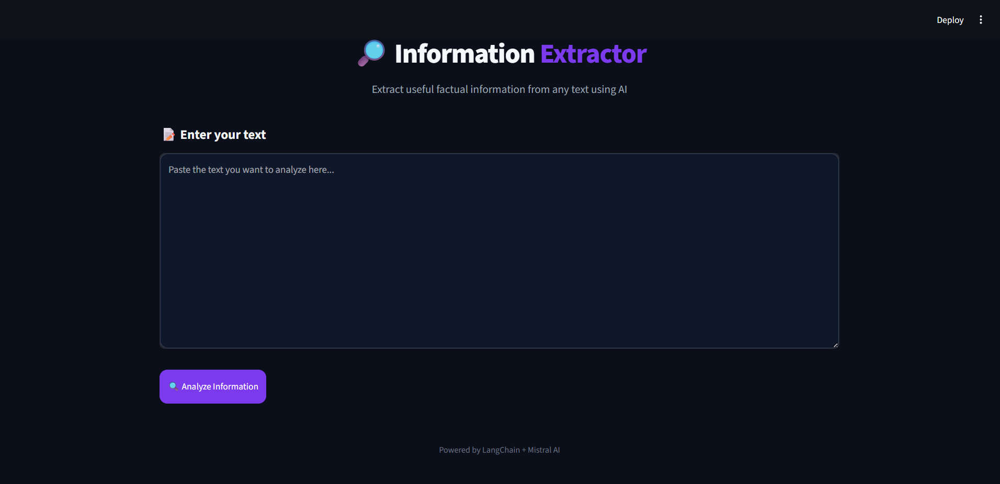

# 🎬 Movie Information Extractor

An AI-powered **Movie Information Extractor** that uses **Streamlit, LangChain, Mistral AI, and Pydantic** to extract structured movie information from a natural-language paragraph.

## 🖥️ Application Preview



## ✨ Features

* 🎬 Extracts movie title
* 📅 Extracts release year
* 🎭 Identifies movie genres
* 🎥 Extracts director information
* 👥 Extracts cast members
* ⭐ Extracts movie rating
* 📝 Generates a movie summary
* 🤖 Uses Mistral AI for intelligent information extraction
* 📦 Uses Pydantic for structured output
* 🖥️ Interactive Streamlit interface

## 🛠️ Technologies Used

* **Python**
* **Streamlit**
* **LangChain**
* **Mistral AI**
* **Pydantic**
* **python-dotenv**

## 📂 Project Structure

```text
Movie-Information-Extractor/
│
├── UIcore.py
├── README.md
├── requirements.txt
└── .gitignore
```

## ⚙️ Installation

### 1. Clone the repository

```bash
git clone https://github.com/khaitanpatil-bot/Movie-Information-Extractor.git
cd Movie-Information-Extractor
```

### 2. Create a virtual environment

```bash
python -m venv .venv
```

Activate it on Windows:

```powershell
.venv\Scripts\activate
```

### 3. Install dependencies

```bash
pip install -r requirements.txt
```

## 🔑 API Key Configuration

Create a `.env` file in the project folder:

```env
MISTRAL_API_KEY=your_mistral_api_key_here
```

**Important:** Never upload your `.env` file or API key to GitHub.

The `.gitignore` file is configured to prevent `.env` from being uploaded.

## ▶️ Run the Application

Start the Streamlit application with:

```bash
streamlit run UIcore.py
```

The application will open in your browser at:

```text
http://localhost:8501
```

## 🧠 How It Works

1. The user enters a movie-related paragraph.
2. The application sends the text to the Mistral AI model through LangChain.
3. The model identifies relevant movie information.
4. Pydantic structures the extracted information.
5. The application displays the movie details in the Streamlit interface.

## 📋 Information Extracted

The application extracts the following information:

| Field    | Description       |
| -------- | ----------------- |
| Title    | Movie title       |
| Year     | Release year      |
| Genre    | Movie genre(s)    |
| Director | Director name     |
| Cast     | Main cast members |
| Rating   | Movie rating      |
| Summary  | Movie summary     |

## 🚀 Future Improvements

* Add IMDb/TMDB API integration
* Add movie poster retrieval
* Add multiple movie comparison
* Add export to JSON/CSV
* Add movie recommendation functionality
* Deploy the application online

## 👨‍💻 Author

**Khaitan Patil**

## 📄 License

This project is available for educational and personal use.
